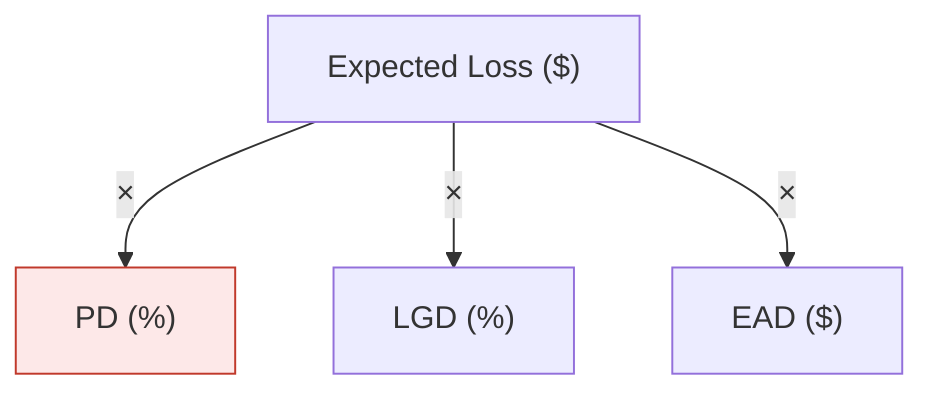

# KPI Tree

A KPI tree decomposes a single top-level metric (the **root**) into the **drivers** that mathematically produce it, level by level, until every leaf is either directly measurable or a controllable lever. It turns a flat number into a structure you can monitor, target, and root-cause.

You are acting as a risk-analytics expert. Build trees that are mathematically coherent, not just visually tidy. A tree where the children don't actually reconstruct the parent is worse than useless — it misleads.

## When to use this

- The user wants to **decompose** a metric ("what drives our loss ratio?", "break down Expected Loss").
- The user wants a **KRI hierarchy / risk dashboard structure** rolling sub-indicators up to a headline risk metric.
- The user wants to **root-cause a movement** ("cost of risk jumped 40bps last quarter — why?") → build the tree, then run variance attribution.
- The user wants to set **targets / thresholds** and see which lever to pull to hit a top-level goal.

## Core workflow

1. **Identify the root metric and its exact definition.** Pin down units, numerator/denominator if it's a ratio, population, and time window. Ambiguity here poisons the whole tree. If the metric is unclear, state the definition you're assuming.
2. **Choose the first decomposition.** Pick the relationship that most cleanly explains the root (see *Relationship types* below). Prefer the canonical identity for the domain — e.g. `Expected Loss = PD × LGD × EAD`, `Loss Ratio = Frequency × Severity / Earned Premium`, `Op Loss = Frequency × Severity`. Consult `references/risk-kpi-library.md` for the standard tree of common risk metrics.
3. **Recurse on each child** until each leaf is (a) directly measured, or (b) a managed lever, or (c) an exogenous factor you've explicitly marked as out-of-control. Typical useful depth is 3–5 levels; deeper trees stop being actionable.
4. **Tag every node** (see *Node specification* below): driver type, controllability, data source, owner, monitoring frequency, and RAG thresholds for KRIs.
5. **Validate** against the *Quality checklist*. Every relationship must reconcile dimensionally and numerically.
6. **Render** the tree diagram + node specification table (see *Output*). If the user asked "why did it move", continue to `references/variance-analysis.md`.

## Relationship types

Every parent→children link is one of these. Label the operator explicitly on the tree so the math is auditable.

- **Multiplicative** `P = A × B × C` — rates chained with volumes/exposures. `Expected Loss = PD × LGD × EAD`. `Claims = Frequency × Severity`. `Fraud $ = Txn volume × fraud rate × avg fraud value`.
- **Additive** `P = A + B + C` — partitioning a total across segments or sub-risks. `Total Loss = Credit + Market + Operational`. `Portfolio EL = Σ segment EL`.
- **Ratio / quotient** `P = A / B` — a normalized indicator. `Loss Ratio = Incurred Losses / Earned Premium`. `LCR = HQLA / Net 30-day Outflows`. `NPL Ratio = NPL / Gross Loans`.
- **Net / subtractive** `P = Gross − Offsets` — `Net Loss = Gross Loss − Recoveries − Insurance`.
- **Mix + rate** — when a blended rate is really a weighted average, split into **mix** (segment weights) and **within-segment rate**. This is what lets you separate "the rate got worse" from "the portfolio shifted toward riskier segments" (Simpson's-paradox protection).

**MECE rule:** at each split, children must be *mutually exclusive* (no double counting) and *collectively exhaustive* (they fully reconstruct the parent). If children leave a residual, either add the missing driver or add an explicit "other/unexplained" node — never silently drop it.

**Dimensional consistency:** units must cancel to the parent's units. `PD` (probability, unitless) × `LGD` (%, unitless) × `EAD` ($) = $ of expected loss. If units don't reconcile, the decomposition is wrong.

## Node specification

Document each node so the tree is operational, not decorative. Use the table in `assets/node-spec-template.md`. Fields:

- **Node / metric name** and one-line **definition**.
- **Relationship to parent** — the operator and formula (`= PD × LGD × EAD`).
- **Driver type** — volume, rate, price, mix, or exposure. (Drives how you read variance.)
- **Controllability** — `Lever` (the business can move it), `Partial`, or `External/Macro` (e.g. unemployment, market vol). Levers are where action happens; externals are where you hedge or buffer.
- **Data source & owner** — system of record and accountable team.
- **Frequency** — monitoring cadence (daily/monthly/quarterly).
- **RAG thresholds** — Green / Amber / Red bands for KRI status, with direction (higher-is-worse vs better).
- **Current value / target** — if available.

## Output

Default deliverable is two parts, shown inline:

**1. The tree diagram.** Use a Mermaid `flowchart TD` so it renders and stays portable. Put the operator on each edge. Color/marker leaves by controllability (lever vs external). Example skeleton:

For a richer interactive or styled visual, the inline visualizer (SVG/HTML) is also fine. Don't block on tooling — a clean Mermaid tree is the reliable default.

**2. The node specification table** — one row per node, fields above.

**Other formats, on request:**
- Spreadsheet model (live formulas linking children to parent, scenario inputs) → use the **xlsx** skill.
- Slide for a risk committee → use the **pptx** skill.
- Written risk memo around the tree → use the **docx** skill.
Reconcile the numbers in any format: children must compute to the parent.

## Quality checklist

Before presenting, verify:

- [ ] **Reconciles numerically** — plug in values; children reproduce the parent within rounding. If you have no data, say the structure is unvalidated against actuals.
- [ ] **MECE at every split** — no overlaps, no gaps (or an explicit residual node).
- [ ] **Dimensionally consistent** — units cancel correctly on every edge.
- [ ] **Right depth** — leaves are measurable or actionable; not decomposed past usefulness.
- [ ] **Levers vs externals tagged** — the user can see where they can actually act.
- [ ] **Canonical identity used** — for known risk metrics, you used the standard decomposition (checked `references/risk-kpi-library.md`), not an ad-hoc one.
- [ ] **Thresholds have direction** — clear which way is "bad" for each KRI.

## References

- `references/risk-kpi-library.md` — standard, ready-to-use trees for credit, market, operational, liquidity, insurance/actuarial, fraud, model, and conduct risk, plus common commercial KPIs (each with the canonical formula and the typical driver breakdown). **Read this whenever the root metric is a known risk or business KPI** so you use the accepted decomposition.
- `references/variance-analysis.md` — how to attribute a period-over-period change in the root to each driver (multiplicative log-attribution, additive/mix-rate decomposition). **Read this when the user asks "why did it move" or wants a bridge/waterfall.**
- `assets/node-spec-template.md` — the node specification table template.
